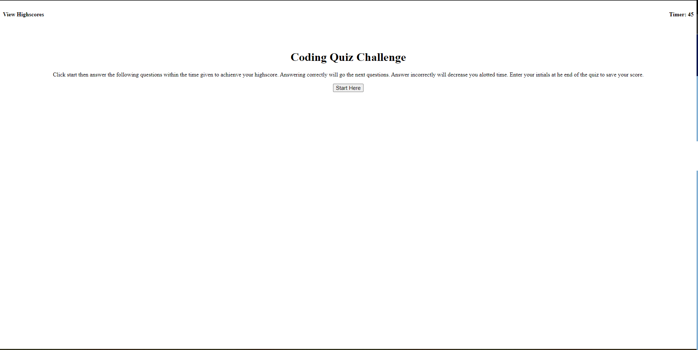

# <api-quiz-program>

## Description

Provide a short description explaining the what, why, and how of your project. Use the following questions as a guide:

- What was your motivation?

My motivation for this project was to learn how to execute multiple functions and event listners to better understand the use of api concepts. I learned how much time it takes to learn then implement concepts when only seeing them one time. Troubleshooting is a long and lengthy process, everything steps ususaly take longer than expected. I also learned the the better I prepare for my tutor sessions that more I can learn in an hour. Also and hour in code time is about 20 minutes in the real world.

## License

Liscense.MIT

## Links

## Screenshots

